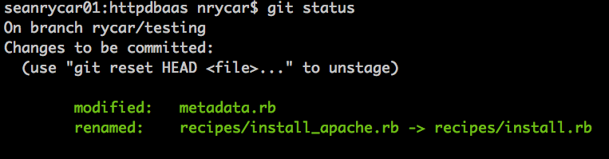
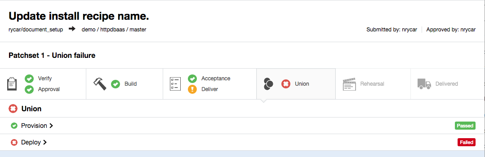
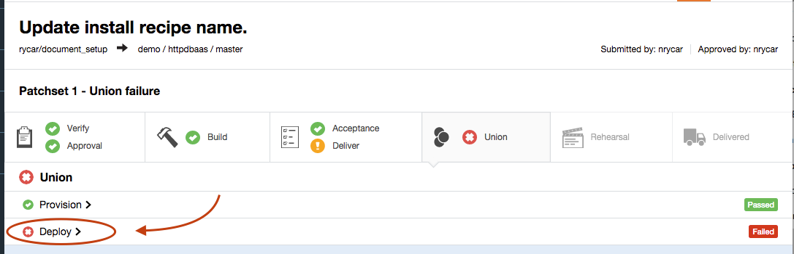
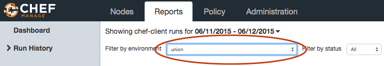

# Scenario: The Apache Cookbook

## Prerequisites

1. You have completed the [UI workflow](simple_UI_workflow.md) guide and are comfortable pushing changes through delivery.

2. You have the following pages open in browser tabs (See your cluster information document for IP addresses):
    * Delivery Server
    * Chef Server

## Scenario

You are a new hire at Company X, and have been tasked with maintaining their apache cookbook, httpdbaas. To familiarize yourself with the cookbook, you have been given access to its delivery pipeline.

### Setup

To prepare, first clone the 'httpdbaas' project from your delivery server to your workstation node. From the workspace directory you set up during the [local cookbook setup](simple_cookbook_workflow.md), the command should look something like:

`delivery clone httpdbaas --ent=YOUR_ENTERPRISE --org=YOUR_ORG --user=committer --server=12.34.56.789`

### Your First Change

On looking through the cookbook, one thing strikes you immediately: the main recipe is titled "install_apache.rb", which strikes you as rather redundant, given that this is already specifically an apache cookbook. You resolve that for your first change, you're going to clean that up a bit -- you don't even have to change any code! 

Let's get the change started! Make sure you cd into the httpdbaas directory, and follow along below.

#### Workflow

1. As before, we're going to need to check out a feature branch, and stage a new update for merge through delivery. 

  * Example:

  ```
  git checkout -b nrycar/apacheupdate
  ```

2. Git has an 'mv' command we can use to rename our recipe.

  * Example:

  ```
  git mv recipes/install_apache.rb recipes/install.rb
  ```

3. Bump the cookbook version in `metadata.rb`

4. Make sure local testing passes. 

  * Example:

  ```
  foodcritic .
  rubocop .
  knife cookbook test httpdbaas -o ..
  chef exec rspec .
  ```

5. Time to stage our change! Just like before, we're going to add our changed files, commit our change, and then submit it to Chef Delivery. 

  * `git add .`

  * At this point, you can confirm your changed files with `git status`. It should look something like this:

  

  * `git commit -m "Your Message Here"`

  * `delivery review --no-open`

#### The March to Union

At this point, you can follow your change through the pipeline as normal. After you review and approve your change, it should make its way through acceptance without issue -- after all, we haven't changed any actual code.

Once you pull the trigger to deliver, however, is when we hit our first snag:



### Exercise: What happened?!

So, what caused our change, which passed acceptance without issue, to suddenly break in union? 

**CHALLENGE:** Determine why our change broke, and see if you can determine how to resolve it without reverting the cookbook back to its previous state.

**HINTS:**

* The delivery summary page allows you to look at the logs for any of the phases that ran. What does it show for Union's deploy stage?

  

* Each deploy will kick off a Chef Client run. What does the Run History (viewable in the `Reports` tab in the Chef Server UI) tell us about our latest deploy attempt?

  * Reminder: You can filter the Run History by environment, and there is an environment that corresponds to each deployable stage in delivery.

  

We'll go over the root cause of the break, as well as some possible remediations in [Part 2](force_break_2.md)

#### Back to the [README](README.md)
