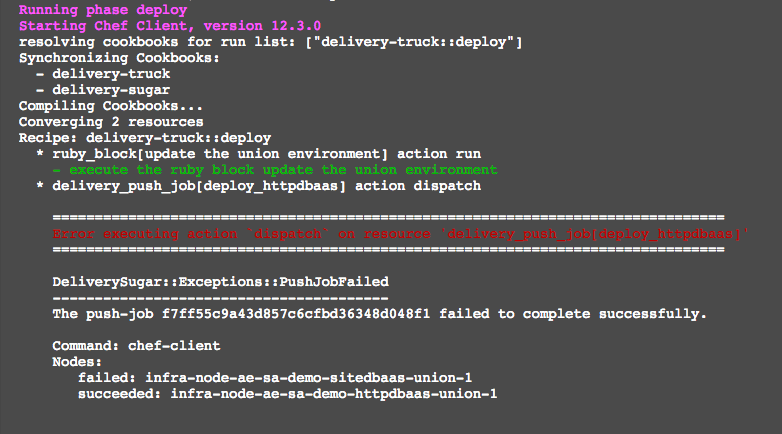
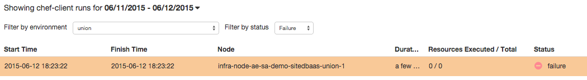
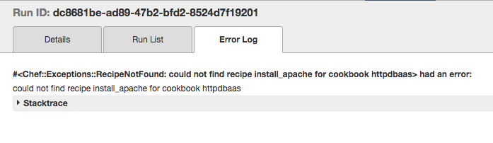

# Scenario: The Apache Cookbook (Continued)

## Part 1: What happened?

Here's where we'll need to dive in a bit and see how delivery is working its magic. We can start by taking a look at our logs of the union deploy. If we scroll down a bit, we can see where our build node is running the `deploy` recipe out of our build cookbook, `delivery-truck`:

Note that this is kicking off a push job that is triggering a chef-client run on two nodes. It actually succeeded on our httpdbaas union node, but note that it's also running chef-client on our sitedbaas union node. 

Recall that while acceptance is doing its testing in isolation, once we get to union, we're potentially validating things across a wider selection of our infrastructure. Let's talk a bit about how delivery is determining where to run.

On our Chef Server, there are a number of environments. There is a singe environment per pipeline for acceptance, as well as single union, rehearsal and delivered environments that contain **all** deploy targets for those respective stages. When we get to the `deploy` phase, delivery is going to submit a push job for any server in its current stage's environment that contains the cookbook we're changing in its run list. In this case, `sitedbaas` (which you may recall from our first exercise) depends on `httpdbaas`, and so when we push a change to the latter, we must validate it against the former.

So! We now know where our deploy failed, but not yet the specific nature of the failure. Here's where chef reporting comes in. 

Chef Reporting tracks each chef-client run made against our Chef Server, and provides us with some useful details. The `Dashboard` view provides us with a general overview of those client runs, and lets us know how many have succeeded/failed/etc in the past 24 hours by default. The `Run History` tells us the specifics of what happened on each client run. Let's hop into that view, and to make life easier, we can filter by the `union` environment and specifically runs that failed. We should see our sitedbaas union node from the previous log here:

If we click on the `Error Log` tab, we can see our problem without even having to dive into the stack trace:

Of course! Even though our code didn't change, we **did** change the name of one of our underlying recipes, and since `sitedbaas` is including that recipe explicitly, it's now complaining that it doesn't know where to find it. 

**This is exactly what we want to see**

Note that this is a change that would have read as valid, but potentially would have broken things if we allowed it to go to production unchecked. Union has saved our bacon by letting us know about the impending failure in our contingent cookbook before our change makes it out to the wild.

## Part 2: Remediate

In our Self-Guided Eval environment, we have access to all the pipelines on our delivery server, but in production, we may not -- we might not even have known there **was** a sitedbaas pipeline until we hit our union break. As such, the easiest fix might be just to keep our old recipe in place alongside the newly renamed one. As such, sitedbaas can keep consuming our `install_apache` recipe while `install` is also available, and we can engage their team to update their code, which will allow us to remove the outdated recipe once and for all.

### Workflow

Rather than try to revert any of the work we've done so far, we can submit a new change with an addition for backwards compatibility. The easiest way to do this is to just copy our install.rb to install_apache.rb, such that both are available, and contain identical code:

`cp -a recipes/install.rb recipes/install_apache.rb`

Don't forget to increment your version in metadata, and test locally, and then run through the same `git add`/`git commit`/`delivery review` process we did earlier.

**NOTE:** If you look at the change summary page for `httpdbaas` (From the menu on the left, select `Organizations`, then click your org, and then the `httpdbaas` project), you'll see all the historical changes that have been submitted to the pipeline, including our broken one from earlier. These will remain available, if you'd ever like to inspect a previous change's phases, or check out their review page to confirm what the code diff was.

### Exercise

Update your `httpdbaas` cookbook via the process defined above, then try updating your sitedbaas cookbook to use the newly available `install` recipe. Once that's done, you should be able to push a new change through `httpdbaas` to remove `install_apache` altogether.

### Back to the [README](README.md)
