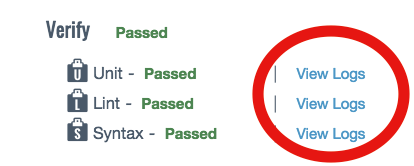
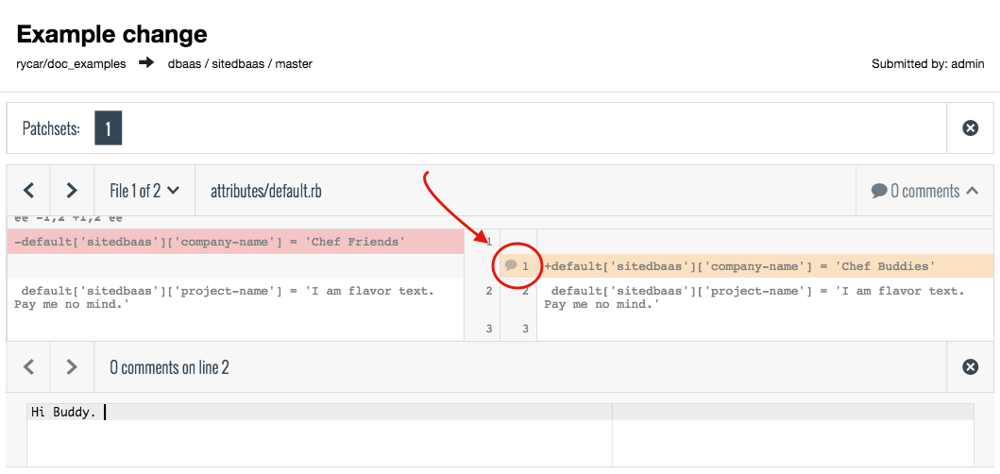
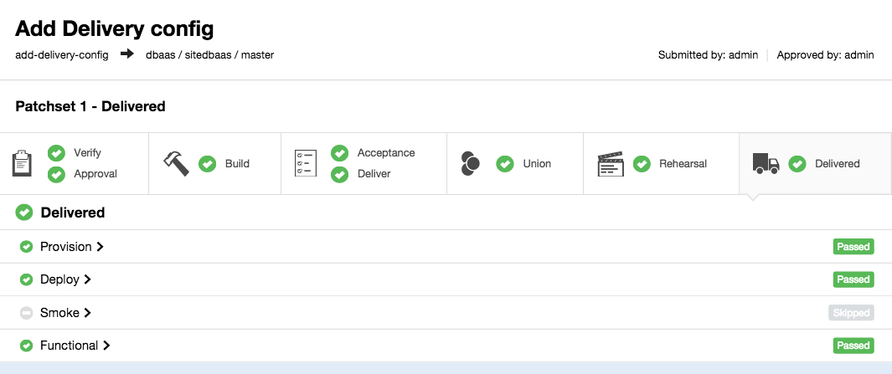

# Delivery UI Workflow

## Prerequisites

1. You followed the [Local Development Cookbook workflow](simple_cookbook_workflow.md) guide and submitted a change for review by running `delivery review`.

2. You have a SOCKS proxy configured per the [Proxy Setup Document](simple_proxy_workflow.md)

3. You have the following pages open in browser tabs (See your cluster information document for IP addresses):
    * Delivery Server
    * Chef Server
    * Acceptance Server
    * Union Server
    * Rehearsal Server
    * Delivered Server

## Workflow

1. The `delivery review` command produced a URL to the pipeline. Open that URL in a browser (Or just pull up your delivery server tab, and navigate to your organization and project). You should land on the Status page of your change, running the **Verify** stage. Make sure that the **Unit, Lint and Syntax** phases passed successfully. If any phase failed, click the failed phase to expand the log, troubleshoot and submit a fixing commit (Steps 4-8 of [Local Development Cookbook workflow](simple_delivery_workflow.md) ).

  * **NOTE:** You can view the logs on the build servers at any time via the "view logs" link on your project's page.

  

  * **NOTE:** When a stage completes, the associated change will auto-collapse in the UI. You can re-expand it at any time by clicking the "View Previous Stages" link at the bottom of a change.

2. When the verify stage completes, click the green arrow on the right-hand side of the change, which will bring you to a summary page for your change. In the upper right-hand corner, you can now click the "Start Review" button to begin code review.

  * **NOTE:** This is where the collaborative part comes in. We strongly advise that the person submitting the change should NOT be the person reviewing it. Hence, take the URL from the previous step and chat/email it to a teammate, asking them for a code review.

3. Review the changes, add a comment (fun fact: supports github emoji, animated GIFs and youtube videos!) and click “add comment” when done. When you’re done, click “approve” in the upper right-hand corner. This will begin the Build and Acceptance stages.

  * **NOTE:** You can click on any of the updated files from this view to see a color-highlighted diff, and can comment on specific lines of a change.

  

4. When Build and Acceptance complete, you’ll hit the second and final human gate. From here, on the summary page, you can now hit “deliver” to submit your change to Union, Rehearsal and Delivered.

5. Once a particular stage's "Deploy" phase has completed, you should be able to refresh the corresponding browser window and see that your content has been updated! Once it gets through "Delivered", your summary page should look something like this:

  * You can click on any of the stages at this point to see the log output for each individual build job.

## Summary

Congratulations! You've just pushed a change through the delivery pipeline! Stay tuned for further updates, and an FAQ/Reference page.