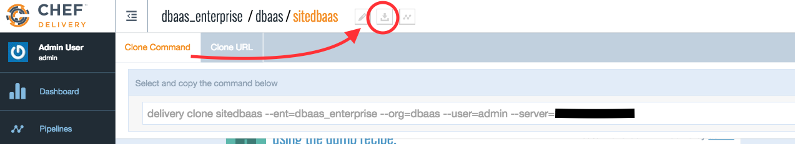

# Local Development Cookbook Workflow

In this example we will clone a project from Delivery, create a feature branch, introduce a change, run local tests and finally submit the change for peer review in Delivery.

**Please refer to your cluster information document for server, organization and enterprise names used in this document **

## Prerequisites

1. [Log into your remote workstation](workstation_setup.md), and make a working directory

        mkdir ~/workspace && cd ~/workspace

2. Setup the delivery-cli config

        delivery setup --server=12.34.56.789 --ent=your_enterprise --org=your_org --user=committer

## Workflow

1. Pick a cookbook project in your Delivery WebUI. Do this by logging in to the UI, selecting your Organization (eg. your_org), selecting a project to check out (eg. sitedbaas), clicking the Clone Project button at the top of the page and copying the command (the command looks something like `delivery clone sitedbaas --ent=your_enterprise --org=your_org --user=committer --server=12.34.56.789` ).

2. Run the copied command from the `~/workspace` folder to clone the project. The output looks something like:

        delivery clone sitedbaas --ent=aws-example --org=sandbox --user=binamov --server=10.194.9.211
        Chef Delivery
        Loading configuration from /Users/bakhinamov/workspace
        Cloning aws-example/sandbox/sitedbaas to sitedbaas
        adding remote: ssh://binamov@aws-example@10.194.9.211:8989/aws-example/sandbox/sitedbaas

  *Clones a project repo and adds a git remote that points at your Delivery server.*

3. Change into the newly created project directory and create a new feature branch in the cloned project:

        cd sitedbaas
        git checkout -b "binamov/greatest-feature-ever"

4. Go ahead and make changes to the cookbook. Some of the easiest things to change are attribute values in `attributes/default.rb`. Don't forget to save the files you change.

5. Bump the cookbook version in `metadata.rb`
    * **IMPORTANT:** You must increment the version in metadata for the change to update your environments properly. 

6. Stage your changes and commit them:

        git add .
        git commit -m "this is the best change ever!"

7. Run lint/unit/syntax tests locally first:

        foodcritic .
        rubocop .
        chef exec rspec .

8. You can now submit your change for Delivery review:

        delivery review
        # add an --no-open flag if you don't want the change to open in the WebUI

  *Pushes the change for review and opens browser to the change in the WebUI.*

#### [Continue in UI workflow](simple_UI_workflow.md)

#### Back to the [README](README.md)
